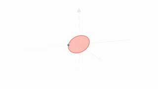

Обучающие занятия по Manim на русском языке

| Описание | Ссылка | Пример анимации |
|---------|------|-------|
| Введение. Работа с текстом.| [Colab](https://colab.research.google.com/github/NMashalov/Ru-manim-tutorial/blob/main/Manim_texts.ipynb) | |
|Использование геометрических фигур и внешних изображений  | [Colab](https://colab.research.google.com/github/NMashalov/Ru-manim-tutorial/blob/main/Manim_geometry.ipynb)|  |
|3d графика, ориентация в пространстве |  [Colab](https://colab.research.google.com/github/NMashalov/Ru-manim-tutorial/blob/main/Manim_3d.ipynb)|    |
|Графы, Manim-physics | [Colab](https://colab.research.google.com/github/NMashalov/Ru-manim-tutorial/blob/main/manim_graph.ipynb) |  |


Вы можете превратить полученное в виде в gif c помощью [ffmpeg](https://ffmpeg.org/). Готовый скрипт [здесь](mp4_to_gif.sh)

Его можно скачать в colab и запустить

```bash
chmod 775 mp4_to_gif.sh
./mp4_to_gif.sh <название_видео> <название gif> 
```


